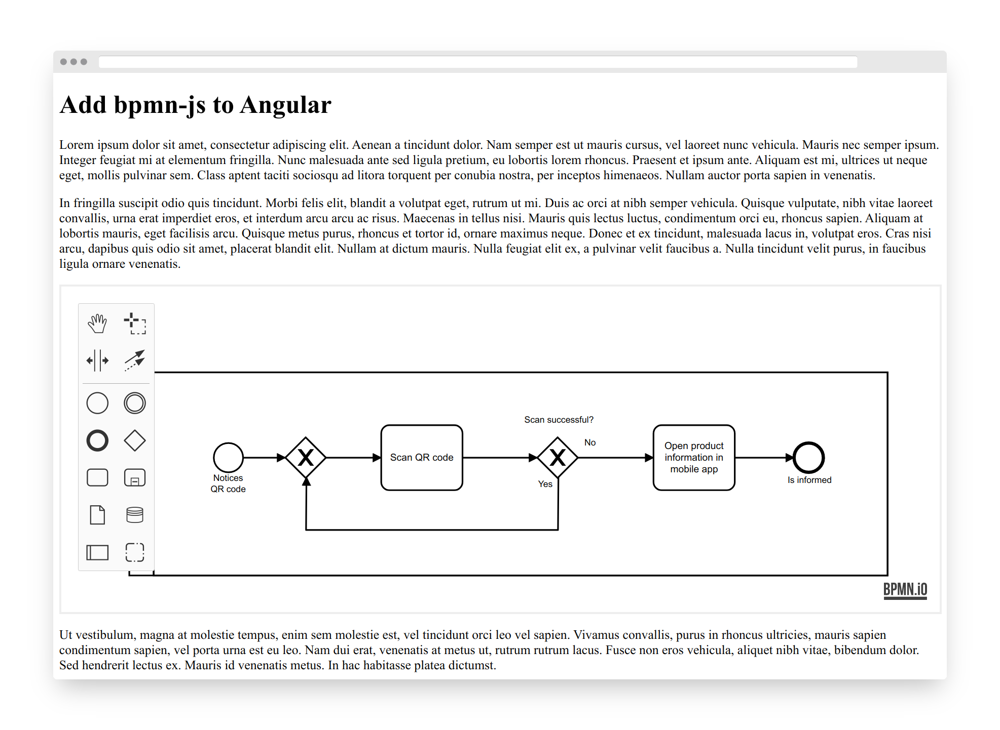

# bpmn-js-example-angular

[](https://github.com/bpmn-io/bpmn-js-example-angular/actions?query=workflow%3ACI)

An example how to integrate bpmn-js with an [Angular](https://angular.io/) application.



## Prerequisites

Assume you bootstrapped your application using the `ng` command:

```sh
ng new bpmn-js-app --defaults=true
cd bpmn-js-app
```


## Integrating bpmn-js

Create a component similar to [`DiagramComponent`](./bpmn-js-app/src/app/diagram/diagram.component.ts):

```typescript
import {
  AfterContentInit,
  Component,
  ElementRef,
  Input,
  OnChanges,
  OnDestroy,
  Output,
  ViewChild,
  SimpleChanges,
  EventEmitter
} from '@angular/core';

import { HttpClient } from '@angular/common/http';
import { catchError } from 'rxjs/operators';

/**
 * You may include a different variant of BpmnJS:
 *
 * bpmn-viewer  - displays BPMN diagrams without the ability
 *                to navigate them
 * bpmn-modeler - bootstraps a full-fledged BPMN editor
 */
import * as BpmnJS from 'bpmn-js/dist/bpmn-modeler.production.min.js';

import { importDiagram } from './rx';

import { throwError } from 'rxjs';

@Component({
  selector: 'app-diagram',
  template: `
    <div #ref class="diagram-container"></div>
  `,
  styles: [
    `
      .diagram-container {
        height: 100%;
        width: 100%;
      }
    `
  ]
})
export class DiagramComponent implements AfterContentInit, OnChanges, OnDestroy {

  // instantiate BpmnJS with component
  private bpmnJS: BpmnJS;

  // retrieve DOM element reference
  @ViewChild('ref', { static: true }) private el: ElementRef;

  @Output() private importDone: EventEmitter<any> = new EventEmitter();

  @Input() private url: string;

  constructor(private http: HttpClient) {

    this.bpmnJS = new BpmnJS();

    this.bpmnJS.on('import.done', ({ error }) => {
      if (!error) {
        this.bpmnJS.get('canvas').zoom('fit-viewport');
      }
    });
  }

  ngAfterContentInit(): void {
    // attach BpmnJS instance to DOM element
    this.bpmnJS.attachTo(this.el.nativeElement);
  }

  ngOnChanges(changes: SimpleChanges) {
    // re-import whenever the url changes
    if (changes.url) {
      this.loadUrl(changes.url.currentValue);
    }
  }

  ngOnDestroy(): void {
    // destroy BpmnJS instance
    this.bpmnJS.destroy();

    this.viewer.attachTo(this.el.nativeElement);
  }
}

```


## Test the Example

```sh
npm install
npm run all
```

## Additional Resources

* [bpmn-js Examples](https://github.com/bpmn-io/bpmn-js-examples)
* [bpmn-js Viewer Documentation](https://github.com/bpmn-io/bpmn-js/blob/main/lib/Viewer.js), [Example](https://github.com/bpmn-io/bpmn-js-examples/blob/main/starter/viewer.html)
* [bpmn-js Modeler Documentation](https://github.com/bpmn-io/bpmn-js/blob/main/lib/Modeler.js), [Example](https://github.com/bpmn-io/bpmn-js-examples/tree/main/modeler)
* [How to add Keyboard-Bindings](https://forum.bpmn.io/t/hotkeys-like-the-demo/89/2) (cf. [`Keyboard` service](https://github.com/bpmn-io/diagram-js/blob/main/lib/features/keyboard/Keyboard.js))

## License

MIT
